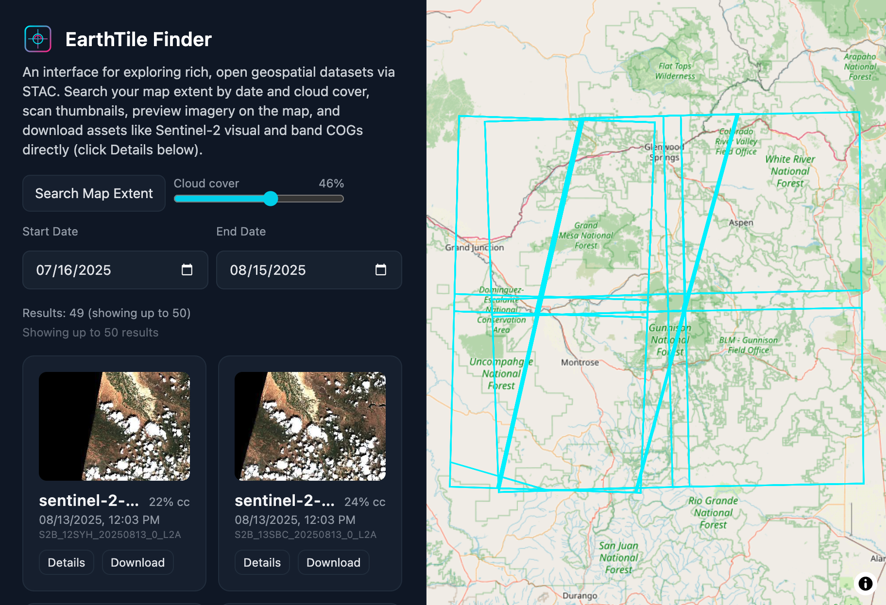

# EarthTile Finder

A lightweight React + MapLibre app to search and preview satellite scenes from a public **STAC API** (Earth Search). It showcases performant geospatial UI, clean API integration, reproducible search state, and optional on‑map imagery preview.



## ✨ Features

* **BBox Search** — Use the current map extent to set the query area.
* **Date Range Filter** — Pick start/end dates.
* **Cloud Cover Filter** — Slider to limit scenes by `eo:cloud_cover`.
* **Interactive Map** — Footprints drawn in MapLibre; click to highlight.
* **Thumbnail Grid** — Scene thumbnails with collection, date, cloud info.
* **Shareable State** — Filters encoded in URL for reproducibility.
* **Durango Default** — Loads last 30 days of Sentinel-2 L2A over SW Colorado on first visit.
* **Error/Loading States** — Clear feedback when searches run or fail.
* **Offline Fallback** — Local sample results if the STAC API isn’t reachable.

## 🛠 Tech Stack

* [React](https://react.dev/) + [Vite](https://vitejs.dev/) + TypeScript
* [MapLibre GL JS](https://maplibre.org/) for map rendering
* [Zustand](https://github.com/pmndrs/zustand) for state management
* [Tailwind CSS](https://tailwindcss.com/) utility‑only styling

## 📦 Install & Run

```bash
# clone
git clone https://github.com/YOURNAME/earthtile-finder
cd earthtile-finder

# install deps
npm install

# start dev
npm run dev
```

## 🔧 Configuration

Create `.env.local` (optional):

```
VITE_STAC_BASE=https://earth-search.aws.element84.com/v1
VITE_STAC_OFFLINE=false           # true = use public/sample.json
VITE_TITILER_BASE=                # e.g., https://titiler.yourhost (optional)
```

## 🔍 How It Works

1. **Controls panel** lets you set filters:

   * `bbox` — automatically grabbed from current map extent.
   * `datetime` — ISO range in `YYYY-MM-DD/YYYY-MM-DD` format.
   * `eo:cloud_cover` — numeric filter.
2. **POST /search** request to [Earth Search v1](https://earth-search.aws.element84.com/v1).
3. Results drawn to:

   * **Footprints layer** in MapLibre.
   * **Grid of cards** with thumbnails and metadata.
   * Optional on‑map preview overlay (TiTiler tiles or static image) for the selected item.
4. **Click card** → highlight footprint + center map.
5. **URL params** updated for reproducibility.

## ⚠️ Notes & Limitations

* Limited to **first 50 results** per search (no pagination in MVP).
* Thumbnail availability varies by collection; placeholder shown if missing.
* STAC API latency can vary — loading state shows progress.
* Fallback `public/sample.json` used if API fails (for offline demo safety).

## 🚀 Deploy (maintainers)

GitHub Actions is configured to deploy to GitHub Pages on pushes to `main`.

1) In repo Settings → Pages, select “GitHub Actions” as the source.
2) Push to `main` (or trigger the workflow manually). The action builds with the correct Vite base and deploys `dist/`.
3) First publish may take 1–2 minutes to propagate. The site is served at `https://<user>.github.io/<repo>/`.

## 🗺 Credits

Prototype by [Richard Donohue, PhD](https://smallbatchmaps.com) — geospatial data scientist & full-stack developer.

Uses open data from [Microsoft Planetary Computer](https://planetarycomputer.microsoft.com/) / Earth Search.
